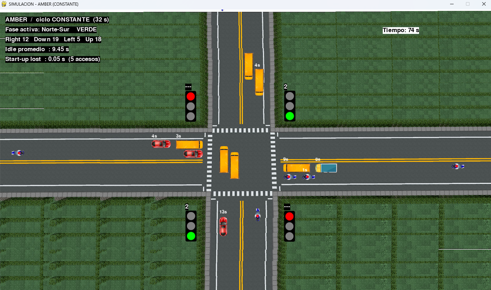
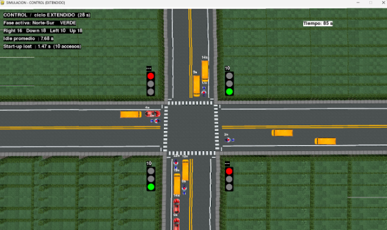

# Traffic Signal Experiment Design

**Auditing my own MSc capstone, and rebuilding the experiment it could not support.**

Most of Europe shows red+amber before green. Australia, New Zealand, Canada and
South Africa do not. In 2023 I tried to answer whether the extra phase improves
traffic flow, using a simulation, as my Master of Data Science capstone.

In 2026 I went back and audited it. The experiment was confounded across six
parameters, three of its metrics measured nothing, and its results were not
reproducible between machines. It could not have answered the question either
way.

This repository documents that audit and the rebuild that followed.

---

## TL;DR

**What is established here:** the original design could not support its
conclusion. The treatment and control hard-coded the very quantity the
hypothesis was about, and the three headline metrics were each broken in a way
that is visible in four lines of code. That part is verifiable from the
snippets below and needs no new experiment.

**What the rebuild adds:** a well-posed version of the comparison, seeded and
deterministic, with the two arms sharing one code path.

**What the rebuild does *not* establish:** whether the red-amber phase is worth
having. The rebuild shows no detectable difference in throughput or delay, but
with one seed per condition it is not powered to make that a finding. And the
large effect on start-up lost time is **an algebraic consequence of the
parameters, not a measurement** — see [What this does not
show](#what-this-does-not-show), which is the most important section in this
README.

The honest summary is that this is a **methods project with a simulation
attached**, not a study that settles the traffic-engineering question.

---

## Background

This started as my Master of Data Science capstone at Western Sydney University
in 2023 (INFO7016 / INFO7017, supervisor Paul Hurley). The original submission
is not in this repository; the code it ran on is quoted below.

---

## What was wrong with the original

### 1. The experiment was confounded

The two scenarios lived in separate files and had drifted apart in **six
parameters at once**:

| Parameter | Amber scenario | Control scenario |
|---|---|---|
| Perception-Reaction Time | **0 s** | **2 s** |
| Start-up time init | 2 | 4 |
| Stopping / moving gap | 15 px | 25 px |
| Green interval | fixed 10 s | random 10-20 s |
| Turning movements | no | yes, 40% |
| Vehicle selection | `randint(0,3)` | `random.choice(list)` |

No observed difference could be attributed to the amber phase.

Worse: `PRT = 0` in the treatment and `PRT = 2` in the control **encodes the
conclusion in the assumptions**. The entire hypothesis is that the amber phase
reduces effective reaction time, and that difference had been written in by
hand.

This is the strongest finding in the repository, and it is checkable by anyone
who reads the two files.

### 2. All three metrics measured something else

**Idle time was always zero.** Accumulated in one branch, wiped three lines later:

```python
self.idle_time += 1     # accumulate
...
if self.speed > 0:      # self.speed is a constant, never 0
    self.idle_time = 0  # reset every frame
```

**Start-up lost time was dead code.** Initialised to `2`, updated only under
`if self.start_up_time == 0`, a condition that never fired. The reported value
was `timeElapsed - 2`, the clock minus a constant.

**PRT never blocked movement.** The countdown sat *after* the block that had
already moved the vehicle.

### 3. Results were not reproducible

Signal timing ran on wall clock (`time.sleep(1)`) while vehicles moved per
frame with no framerate cap. On a slower machine the signals advanced faster
than the traffic, and results changed between computers.

### 4. The signal model was not an intersection

The original cycled all four approaches one at a time. Opposing movements are
not conflicting and run concurrently in any real intersection. The corrected
model uses two phases (North-South, East-West).

---

## The rebuild

Two scenario files will always drift. One file with a single switch drifts
less:

```python
# The phase ordering, and the only intentional difference between the arms:
if ESCENARIO == "AMBER":
    correrIntervalo('amber_start', AMBAR_ARRANQUE)   # red+amber, 2 s
    correrIntervalo('green', VERDE)
    correrIntervalo('amber_clear', AMBAR_DESPEJE)    # clearance, 4 s
else:
    correrIntervalo('green', VERDE)
    correrIntervalo('amber_clear', AMBAR_DESPEJE)
```

PRT is the same constant in both arms. What differs is when the driver receives
the cue.

**One honest caveat about "a single switch":** adding 2 s of amber while holding
both green *and* cycle length fixed is impossible, so something has to give.
Two cycle designs are run to bracket it:

| Design | Amber arm | Control arm | What is held fixed |
|---|---|---|---|
| Fixed cycle | green 10 s | **green 12 s** | cycle length (32 s) |
| Extended | green 10 s | green 10 s | **green time** (cycle 32 vs 28 s) |

So neither design is a clean one-factor contrast, and the original cannot be
indicted for six-parameter drift without admitting that the rebuild has one
unavoidable second factor. Running both designs is how that is handled, not a
claim that it went away.

Seeded and framerate-capped, so the same configuration produces the same output
on any machine. Common random numbers are used across all four conditions,
which is standard simulation practice and reduces the variance of the
between-arm comparison.

---

## Results

Four runs: 2 scenarios x 2 cycle designs, 300 s each, identical seed. Figures
below are the **fixed-cycle design** unless stated.

| Metric | Amber | Control | Difference | Test |
|---|---|---|---|---|
| Start-up lost time (per phase-approach) | 0.05 s | 1.51 s | -96.5% | see caveat below |
| Idle time (per vehicle) | 11.10 s | 9.84 s | +12.8% | Welch p = 0.067, Hedges g = 0.16 |
| Total delay (per vehicle) | 23.90 s | 22.73 s | +5.1% | Mann-Whitney p = 0.258 |
| Vehicles cleared | 265 | 268 | -1.1% | *no test possible, n = 1 per condition* |
| PRT consumed (per vehicle) | 1.45 s | 1.39 s | +4.4% | Welch p = 0.459 |

Note the direction: the amber arm is **slightly worse on every outcome
measure**. None of those differences is large — the idle-time effect size is
g = 0.16, which is trivial even though its p-value is the lowest of the three.

### Effective green

| Condition | Green | Phase | Cycle | Start-up | Effective green | % of cycle | Vehicles |
|---|---|---|---|---|---|---|---|
| Control / fixed cycle | 12 | 16 | 32 | 1.51 | 10.49 | 32.8% | 268 |
| Amber / fixed cycle | 10 | 16 | 32 | 0.05 | 9.95 | 31.1% | 265 |
| Amber / extended | 10 | 16 | 32 | 0.06 | 9.94 | 31.1% | 266 |
| Control / extended | 10 | 14 | 28 | 1.54 | 8.46 | 30.2% | 264 |

Effective green as a share of cycle spans an 8.5% relative range across the four
conditions. Throughput spans 1.5%. **If throughput tracked effective green those
ranges would be comparable, and they are not** — a capacity story predicts about
23 vehicles of spread and four were observed. The rank order does not match
either: the middle two conditions are inverted.

The likely reason is in the saturation table: at 88-89% of demand cleared, the
intersection is only marginally oversaturated, so throughput is closer to
demand-limited than capacity-limited. Either way, four conditions at one seed
each, with a total spread of four vehicles, cannot distinguish these stories.

### Break-even, and why it is not a result

```
Start-up lost time eliminated : 1.53 s
Cost of the starting amber    : 2.00 s
--------------------------------------
Net balance per phase         : -0.47 s
```

This arithmetic is **the inequality `PRT < AMBAR_ARRANQUE`, restated**. Both
terms are input parameters. The simulation contributes nothing to this line.

| PRT | Balance vs a 2.0 s amber | Outcome |
|---|---|---|
| 1.0 s | -1.00 s | loses |
| **1.5 s (used here)** | **-0.50 s** | **loses** |
| 2.0 s | 0.00 s | breaks even |
| 2.5 s (AASHTO design value) | +0.50 s | gains |

Published perception-reaction times run roughly 1.0 to 2.5 s depending on the
source and the task. **The sign of the answer changes inside that range.** The
1.5 s used here is a chosen value, not a calibrated one — see [Domain
calibration](#domain-calibration). Until PRT is pinned to field data, this table
is a statement of what the answer depends on, not the answer.

---

## What this does not show

Read this before citing any number above.

**1. The start-up lost time effect is arithmetic, not a measurement.**

Start-up lost time is defined as `primer_cruce_s - verde_inicio_s`. With
`PRT = 1.5` and `AMBAR_ARRANQUE = 2.0`, the driver's reaction countdown under
the amber arm finishes before green even begins, so its expected value is
`max(0, 1.5 - 2.0) = 0`. Under control it starts at green, so its expected value
is `1.5`. **The result is exact and requires no simulation to predict.**

The data confirm this rather than test it: each group contains only eight
distinct values, spaced at 1/60 s, which is the frame step. There is no
stochastic variation in this outcome, only quantization. Consequently the
effect size is meaningless — Hedges g is 8.4 as computed, and **93.7 if a single
row is removed**, because the denominator is measurement artefact rather than
variability. `analysis.py` prints both and says so.

An earlier version of this README described the difference as one that "emerges
as a measured outcome instead of an input". That was wrong. Replacing
`PRT = 0` vs `PRT = 2` with one shared PRT removed a *numeric* hard-coding and
left a *structural* one. The arm given a 2.0 s head start on a 1.5 s reaction
cannot produce any other answer.

What the number is still good for: it confirms the instrumentation now measures
what it claims, which the original's version did not. That is a passing sanity
check, not a finding.

**2. There is one replicate per condition.**

The unit of randomisation is the run, so n = 1 per arm. The 34 to 42
phase-approaches are subsamples of a single traffic history that share queue
state between them, not replicates. Between-run variance is not small; it is
unestimated, because nothing here can estimate it. Every p-value in this
repository understates its standard error for that reason.

**3. "No improvement in throughput or delay" means no difference was
detectable.**

That is not the same as showing there is none. There is no power analysis, no
minimum detectable effect and no equivalence bound, so the design cannot support
accepting the null.

**4. The audit does not prove the original's conclusion was false.**

"The original design could not support its conclusion" and "the original
conclusion is wrong" are different claims. This repository establishes the first.
An invalid study can still reach a true conclusion by luck, and the rebuild does
not have the statistical standing to overturn anything — at best it declines to
reproduce.

**5. Phases with no queue are discarded**, which conditions on a post-treatment
variable and leaves unequal n between arms (34 vs 36, and 34 vs 42). Under
near-saturation the bias is probably small, but it is not quantified.

**6. The phase timings mix jurisdictions.** Starting amber is a UK value,
clearance amber is Australian. The modelled intersection corresponds to no real
country, and there is no all-red period in either arm. Since the whole
break-even argument is a ledger in seconds, that matters.

**7. The starting amber is modelled as 2.0 s added to the cycle.** In UK
practice the red/amber period generally sits within the intergreen rather than
extending the cycle by a full 2 s. If it is even partly absorbed, the cost term
above is overstated.

---

## What would make this a real result

In priority order:

1. **N seeds per condition**, compared at replicate level, so between-run
   variance is estimated rather than assumed away.
2. **Calibrate or sweep PRT as an experimental factor.** It is currently the
   parameter the entire conclusion turns on and the only one without a source.
3. **A low-demand scenario.** Everything here is at 88-89% clearance; start-up
   lost time should matter more when the intersection is not the binding
   constraint.
4. **Model the red/amber inside the intergreen** as an alternative to adding it
   to the cycle, and compare.
5. **Turning movements**, which would change the phase structure.

---

## Running it

```bash
pip install -r requirements.txt
cd src
python fetch_assets.py     # pulls the sprites from the upstream repo, once
python simulator.py
```

The vehicle and signal images are not versioned here: they belong to the
upstream Apache-2.0 project, so `fetch_assets.py` downloads them instead.

Two lines control the experiment:

```python
ESCENARIO    = "AMBER"       # or "CONTROL"
DISENO_CICLO = "CONSTANTE"   # or "EXTENDIDO"
```

Each run writes `vehiculos_<scenario>_<design>_seed<N>.csv` and
`fases_<scenario>_<design>_seed<N>.csv`. Change `RANDOM_SEED` for a new replicate.

Analysis, which runs on the committed data with no simulation required:

```bash
cd analysis
python analysis.py
```

Both the phase-level and vehicle-level CSVs for seed 42 are committed, so this
reproduces every table in this README. If the vehicle-level files are absent the
script skips the tables that need them and says so rather than exiting.

**Note on pygame:** on Python 3.14 use `pygame-ce`, which ships prebuilt wheels.
Stock `pygame` 2.6.1 only publishes wheels up to cp313 and will try to compile
from source.

---

## Repository layout

```
src/simulator.py       the simulation, both scenarios, one code path
src/fetch_assets.py    downloads the sprites from the upstream repo
data/fases_*.csv       phase-level output, 146 records
data/vehiculos_*.csv   vehicle-level output, 1063 records
analysis/analysis.py   summary tables, effect sizes, effective green, break-even
docs/standards.md      where the 2 s and 4 s intervals come from
docs/screenshot-*.png  the simulation running, one frame per scenario
```

The simulation is seeded and framerate-capped, so re-running the four
configurations should regenerate these files. That is asserted from the design,
not demonstrated by a hash or a CI check, and the upstream code it builds on
uses threading, so treat it as a design intent rather than a guarantee.

### Data schema

`vehiculos_*.csv`, one row per vehicle that crossed:

| Column | Meaning |
|---|---|
| `escenario`, `diseno_ciclo`, `semilla`, `verde_s` | run configuration |
| `fase`, `direccion`, `carril`, `tipo` | phase group, approach, lane, vehicle class |
| `spawn_s`, `cruce_s` | spawn and stop-line crossing, in simulation seconds |
| `demora_total_s` | total delay |
| `idle_time_s` | accumulated seconds stopped |
| `prt_gastado_s` | perception-reaction seconds actually consumed |

`fases_*.csv`, one row per green phase per approach:

| Column | Meaning |
|---|---|
| `verde_inicio_s` | green onset |
| `cola_al_inicio` | queue length at onset |
| `primer_cruce_s` | first queued vehicle crossing the stop line |
| `start_up_lost_s` | `primer_cruce_s - verde_inicio_s` |

---

## Domain calibration

| Interval | Value | Source |
|---|---|---|
| Red+amber (starting) | 2.0 s | UK DfT, Traffic Advisory Leaflet 1/06 |
| Amber (clearance) | 4.0 s | Australian Traffic Signal Standard TS001, 50-60 km/h |
| **Perception-reaction time** | **1.5 s** | **none — chosen, not calibrated** |

TS001 clearance amber by posted speed: 40 km/h 3.0 s, 50-60 km/h 4.0 s,
70 km/h 4.5 s, 80 km/h 5.0 s, 100 km/h 6.0 s.

The PRT row is the weak point and is listed here rather than buried in the code.
It is the parameter the break-even argument turns on, and it is the one without
a source.

---

## Screenshots



*Amber / fixed cycle, t = 74 s. Running mean start-up lost time 0.05 s over 5
phase-approaches.*



*Control / extended cycle. Running mean start-up lost time 1.47 s over 10
phase-approaches.*

These are running means at arbitrary moments from **different cycle designs at
different elapsed times**, so no number visible in them is comparable across the
two frames, and none matches a table above. They are here to show the
instrumentation and the two-phase signal model, nothing more.

---

## Attribution

The simulation is built on the Pygame traffic simulator from **Gandhi, M.,
Solanki, D., Daptardar, R. & Baloorkar, N. (2020)**, *Smart Control of Traffic
Light Using Artificial Intelligence*, IEEE ICRAIE 2020:
[mihir-m-gandhi/Adaptive-Traffic-Signal-Timer](https://github.com/mihir-m-gandhi/Adaptive-Traffic-Signal-Timer),
Apache License 2.0. The sprite and signal images are from that project and are
fetched by `src/fetch_assets.py`.

Their code already used classes and multithreading. What is mine is the
red-amber-before-green phase ordering, the two-phase concurrent movement model,
the three instrumented metrics, the single-code-path experimental design, the
deterministic simulation clock, and the analysis.

---

## Why this is a data science project

It contains no model and no accuracy score. It is about the other half of the
discipline:

- **Experimental design** — finding a six-parameter confound in my own work and
  fixing it structurally rather than by hand
- **Instrumentation** — validating that a metric measures what it claims, and
  then noticing that a validated metric can still be a tautology
- **Reproducibility** — seeded, deterministic, machine-independent, with the
  data committed so the analysis runs on a fresh clone
- **Causal reasoning** — separating "the intervention has the stated effect"
  from "the intervention improves the outcome", which are different claims
- **Knowing what a result is** — an effect that falls out of the parameters is
  not a discovery, a p-value computed over subsamples of one run is not
  evidence, and a null under an underpowered design is not a negative result

The last one is the point. This repository originally reported a 96% improvement
with a large effect size and a very small p-value. All three numbers were real
in the sense that the arithmetic was right, and none of them meant what the
headline said. Catching that in my own work is the skill the project is actually
evidence of.

---

**Yamit Chinchilla** - Data Analyst & Data Scientist
MSc Data Science, Western Sydney University
